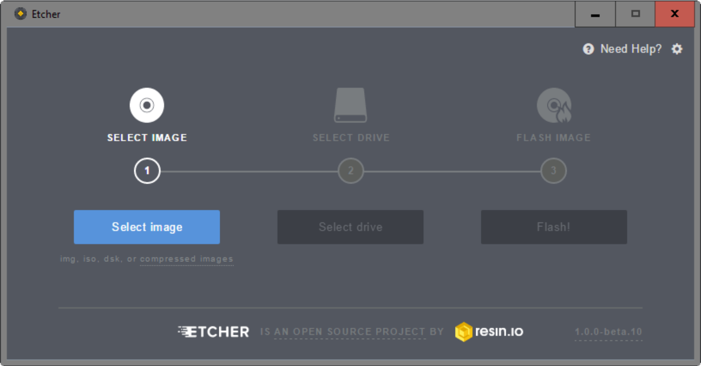

Burn Raspberry Pi OS System
=============================

1. Prepare the following items and tools：
   
+-----------------+---------------------+
|Raspberry Pi     |1 * Power Adapter    |
+-----------------+---------------------+
|1 * Mirco SD Card|1 * Personal Computer|
+-----------------+---------------------+

2. Prepare the tool of image burning. Here we use the 
**Etcher**. You can download the software here: 
https://www.balena.io/etcher/. 

3. Download the **Raspberry Pi OS** image file here: 
https://www.raspberrypi.org/downloads/raspberry-pi-os/

4. Unzip the package downloaded and you will see the 
**.img** file inside. 

.. Note::
    
    Do not extract the .img file. 

5. With Etcher, flash the image file into the SD card.
   
