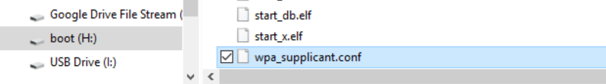
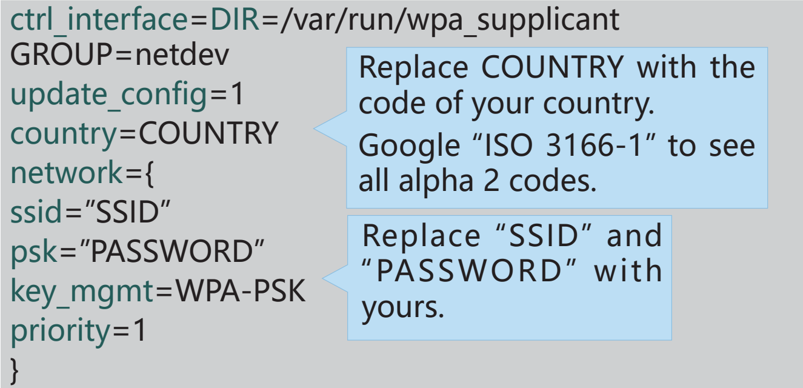
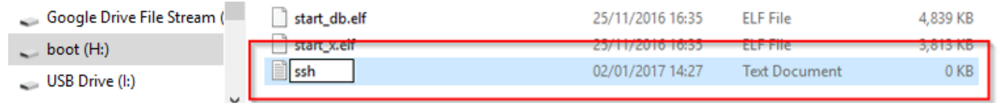

Connect the Raspberry Pi to the Internet
===============================================

You need to modify a Wi-Fi configuration file wpa_supplicant.conf in the Micro SD card by your PC that is located in 
the directory /etc/wpa_supplicant/.

If your PC is working on a linux system, you can access the 
directory directly to modify the configuration file; however, if your PC use Windows system, what you need next is 
to go to the directory, /boot/ to create a new file with the 
same name, **wpa_supplicant.conf**. This file will overwrite 
the original Wifi configuration file at the next boot.

Input the following content in the file:

You also need to add an empty ssh file to enable the remote access the command line function.

Now, the Raspberry Pi OS system is configured. 
When the Micro SD card is inserted into the Raspberry Pi, 
you can use it immediately.
