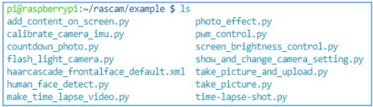

DIY Function
-----------------

Rascam comes with many interesting functions that you 
can try one by one or combine them to be new ones.

1. Enter the folder and list the example files. 

.. code-block::

    cd /home/pi/rascam/example

2. List the example files. 

.. code-block::

    ls

.. note::
    
    ls is a command to list computer files. When invoked 
    without any arguments, ls lists the files in the current 
    working directory.

3. You can run the python codes by the following command.

.. code-block::

    sudo python3 photo_effect.py

4. You can use or refer to the following examples:
   
**add_content_on_screen.py**

This example is used to make the LCD display the word 
information when it work as a viewfinder.

**photo_effect.py**

This example can be used to add the filter for photos 
and toggling

**calibrate_camera_imu.py**

If the shot pictures are inverted, you may have to calibrate the IMU by following the descriptions below.

1. Run this example.

2. Hold the Rascam.

3. Press “s” to start your calibration.

4. Let Rascam separately rotate 360° along x, y, and z in a slow way.

5. Press Ctrl + C to exit the example.

**countdown_photo.py**

This example makes you take a countdown photo.(8s by default)

**screen_brightness_control.py**

It is an LCD screen brightness control example.

**flash_light_camera.py**

This example makes a flash when you take photos.

**show_and_change_camera_setting.py**

Long press the joystick button to enter custom menu, 
and there will appear the adjusting options (brightness, 
contrast ratio) that you can add or modify by coding.

**human_face_detect.py**

This function makes Rascam detect faces.

**make_time_lapse_video.py**

This example sets the time-lapse photography for 
Rascam. Before using it, you need to open the code file 
via editor and modify some parameters (e.g. the image 
size and the shooting duration).

**take_picture_and_upload.py**

It can upload the shot photos of Rascam to Google 
Drive. You need to verify the Google account first. 
Steps are:

1. Enter the website: https://developers.google.com/drive/api/v3/quickstart/python.

2. Login account.

3. Click the (Enable the Drive API) button to open Google Drive API service.

4. Select default option 'desktop app'.

5. Click (download client configuration) to download the file name credentials.json.

6. Place credentials.json. in the '/home/pi/rascam/rascam' folder.

7. Connect the screen and keyboard to RPi.

8. Run the example in RPi terminal.

.. note::
    
    The browser will pop up to guide you log in your Google account. 

9. After completing the authentication, you will be able to use the example without external devices.

**web_control**

Use this function to control Rascam remotely via 
browsers. Steps are:

1. Execute step 1~8 of \"take_picture_and_upload.py\". If steps have been executed, skip the operation.

2. Go into the path:

.. code-block::

    cd /home/pi/rascam/example/web_control

3. Run the python code:

.. code-block::

    sudo python3 start_server.py

4. Input the IP of Rascam on the browser of your devices to enter the using page.

5. Play it.

**Copyright Notice**

All contents including but not limited to texts, images, and 
code in this manual are owned by the SunFounder Company. 

You should only use it for personal study, investigation, enjoyment, or other non-commercial or nonprofit purposes, 
under the related regulations and copyrights laws, without 
infringing the legal rights of the author and relevant right 
holders.

For any individual or organization that uses these for commercial profit without permission, the Company reserves 
the right to take legal action. 