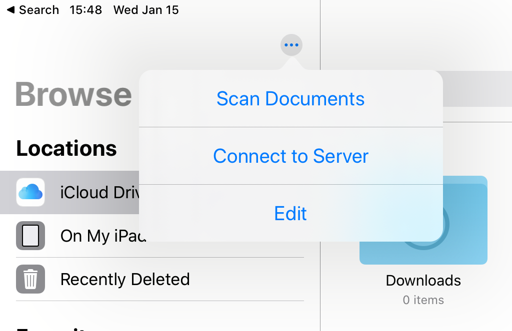

Mount Photo album to iOS
===============================

The system newer than **iOS 13.0** can directly mount storage in Files. The older versions of iOS can use APPs like DS 
File.

1. Open **Files**.

.. image:: media/14.png
    :align: center

2. Tap **Connect to Server** in **「Menu」**.

3. Enter your Rascam IP address.

.. image:: media/16.png
    :align: center

4. Log in.

5. Now, you can directly access the photo album in File.

