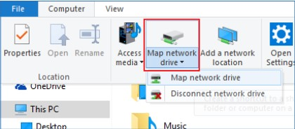
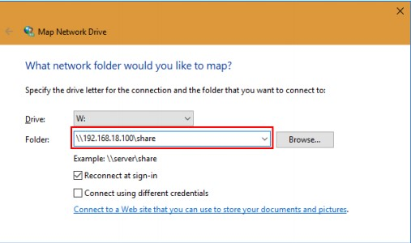
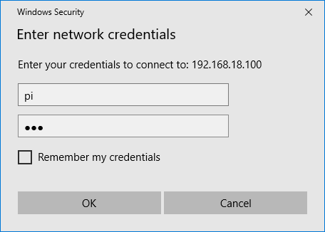
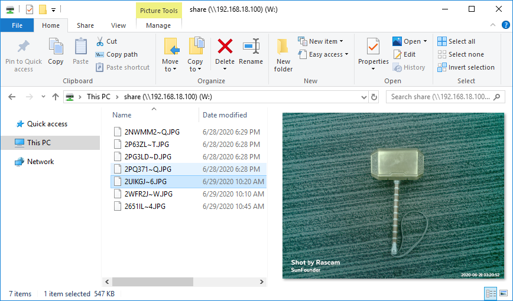

Mount Photo Album to Windows
==============================

Under This PC, click **Map network drive**.

Type "\\\\hostname or IP address\\the name of the shared files" in the path bar. 

Type in the username and the password. Click OK button, 
and you can access the shared files.

The album will appear as a new volume under this PC.

