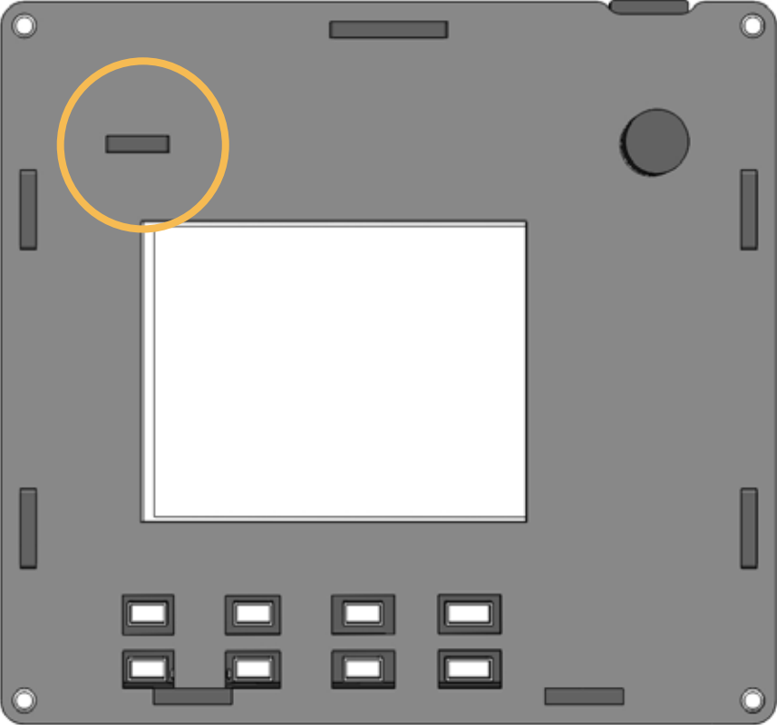

Power On
===========

Press Power Button to start Rascam. The power button has three functions:

1. Press once to start Rascam.
   
2. Press twice to power off.
   
3. Long press to shutdown RPi. 

.. note::

    Initialize the Environment first when using the function 3.
