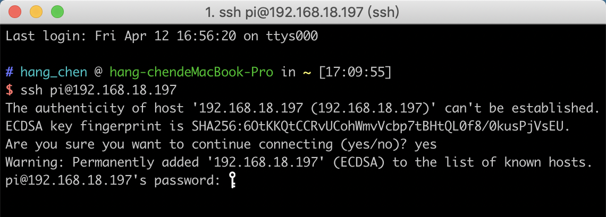
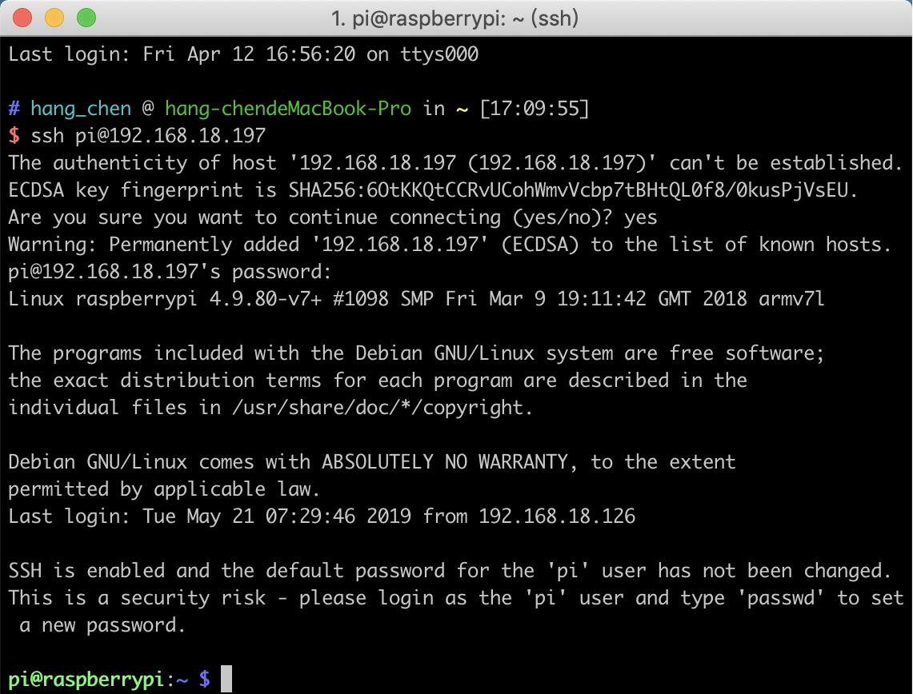
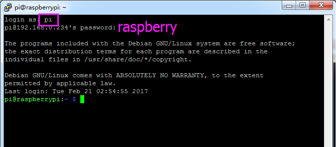
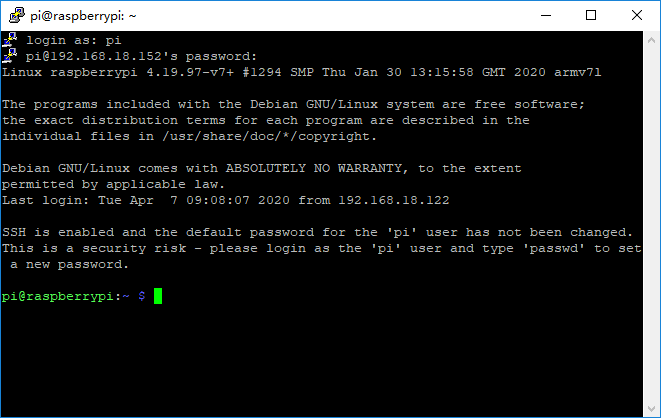

Remote Control
==================

We can open the Bash Shell of Raspberry Pi by applying 
SSH. Bash is the standard default shell of Linux. The Shell 
itself is a program written in C that is the bridge linking the 
customers and Unix/Linux. Moreover, it can help to complete most of the work needed. 

For Linux or/Mac OS X Users
---------------------------------

1. Go to Applications->Utilities, find the Terminal, and open it.
   
.. image:: media/6.png
    :align: center

2. Type in ssh pi@ip_address. “pi” is your username and “ip_address” is your IP address. For example: 
   
.. code-block::

    ssh pi@192.168.18.197

3. Input ”yes”.
   
.. image:: media/7.png
    :align: center

4. Input the passcode and the default password is “raspberry”.

.. note::

    When you input the password, the characters do not display on window accordingly, which is normal. What you need is to input the correct passcode.

5. We now get the Raspberry Pi connected and are ready 
to go to the next step.

For Windows Users
---------------------------------

If you’re a Windows user, you can use SSH with the application of some software. Here, we recommend PuTTY.

1. Download PuTTY.

2. Open PuTTY and click Session on the left tree-alike 
structure. Enter the IP address of the RPi in the text 
box under Host Name (or IP address) and 22 under 
Port (by default it is 22). Click Open. 

.. image:: media/10.png
    :align: center

.. note::

    When you first log in to the Raspberry Pi with the 
    IP address, there prompts a security reminder. Just 
    click Yes.

3. When the PuTTY window prompts “login as:”, type in 
“pi” (the user name of the RPi), and password: “raspberry” 
(the default one, if you haven’t changed it). 

.. note::

    When you input the password, the characters do 
    not display on window accordingly, which is normal. 
    What you need is to input the correct passcode.

4. Here, we get the Raspberry Pi connected and it is time 
to conduct the next steps.

