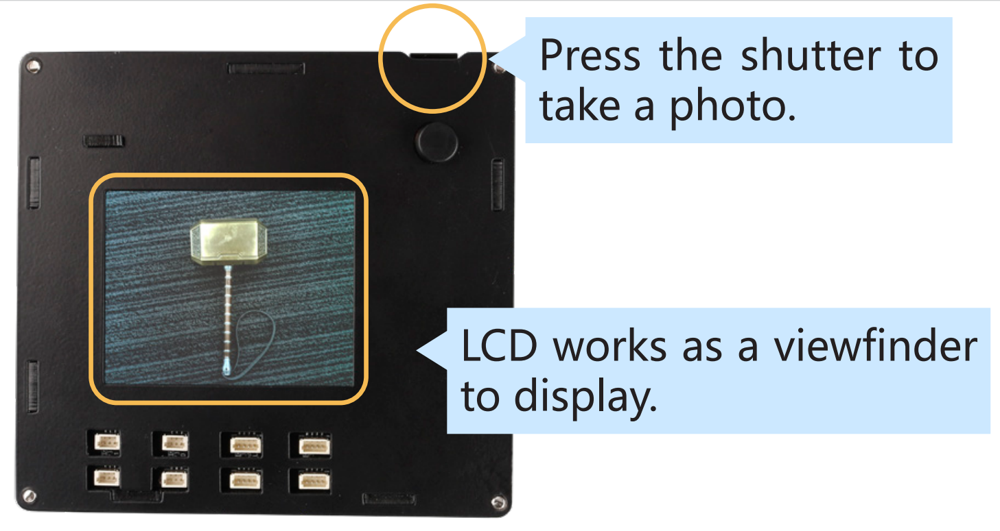

Take a Photo 
==================

You can make the LCD a viewfinder and press the shutter 
to take a photo. The methods:

1. Enter the folder. 
      
.. raw:: html

    <run></run>

.. code-block::

    cd /home/pi/rascam/example

2. Run the program code.

   
.. raw:: html

    <run></run>

.. code-block::

    sudo python3 take_picture.py

The shot photos are stored at this path.
   
.. raw:: html

    <run></run>

.. code-block::

    /home/pi/Pictures/rascam_picture_file

3. Press Ctrl+C to stop the example.